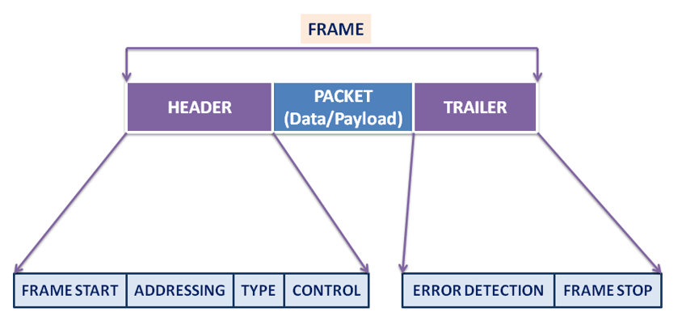

## Introduction 

Packet switching is a modern communication technique in which data is
divided into smaller units called packets, and each packet is sent
independently across a network. Unlike circuit switching, which reserves
a dedicated path for the whole communication session, packet switching
allows multiple devices to share the same communication network
efficiently.

Packet switching forms the backbone of the internet, enabling services
such as web browsing, emails, social media, video streaming, cloud
computing, and instant messaging.

### 1. What is a Packet?

A packet is the smallest unit of data transmitted in a packet-switched
network. When a message is sent, it is broken into multiple packets.
Each packet contains:

-   A portion of the data
-   Source and destination addresses
-   Sequence numbers
-   Error detection information

These components ensure that packets can be routed, checked, and
reassembled.

#### Structure of a Data Packet

 
               
    <!--  -->
    
      
      <figcaption><strong>Fig. 1 Structure of Data Packet</strong></figcaption>
   

### 2. Working of Packet Switching

#### 2.1 Segmentation of Data

The data to be sent is divided into fixed-size or variable-size packets.

#### 2.2 Independent Transmission

Each packet travels independently. Packets may follow: - The same
route - Different routes - Alternate routes during congestion

#### 2.3 Routing at Intermediate Nodes

Routers inspect packet headers and forward them based on routing tables
and network conditions.

#### 2.4 Reassembly

Packets arriving at the destination are reassembled using sequence
numbers.

#### 2.5 Error Handling

If any packet is lost or corrupted, the system requests retransmission.

#### Packet Switching Working Diagram

               
    <!--  -->
    
      
      <figcaption><strong>Fig. 2 Packet Switching working diagram</strong></figcaption>
   

### 3. Types of Packet Switching

Packet switching is categorized into two types:

#### 3.1 Datagram Packet Switching

Datagram packet switching is a connectionless method where each packet
is treated independently and carries its own destination address. Each
packet may take a different route through the network depending on
traffic and availability.

**Characteristics:** - No pre-established route - Packets are routed
independently - Packets may arrive out of order - Used on the Internet
(IP networks)

#### 3.2 Virtual Circuit Packet Switching

Virtual circuit packet switching is a connection-oriented method where a
temporary logical path is established between the sender and receiver
before data transmission begins.

**Characteristics:** - A logical route is established beforehand - All
packets follow the same route - Packets arrive in order - Used in ATM
and Frame Relay networks

### 4. Characteristics of Packet Switching

1.  No dedicated physical path
2.  Efficient resource utilization
3.  Highly scalable
4.  Packets may take alternate routes
5.  Supports bursty data traffic
6.  Robust against failures
7.  Dynamic routing decisions

### 5. Advantages of Packet Switching

-   Efficient bandwidth usage
-   Fault-tolerant and adaptable
-   Supports multiple users simultaneously
-   Reliable with error-correction mechanisms
-   Scalable to large networks
-   Ideal for internet-based services

### 6. Disadvantages of Packet Switching

-   Packets may arrive out of order
-   Higher latency under congestion
-   Requires complex protocols
-   Not ideal for real-time communication without QoS

### 7. Applications of Packet Switching

Packet switching is used in: - Internet communication - Email
transmission - Web browsing - Instant messaging (WhatsApp, Telegram) -
Voice over IP (VoIP) - Video conferencing (Zoom, Google Meet) - Cloud
computing - Online gaming - File transfer (FTP/SFTP)
